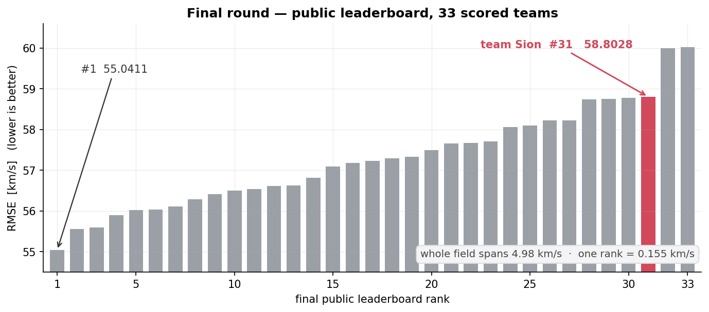
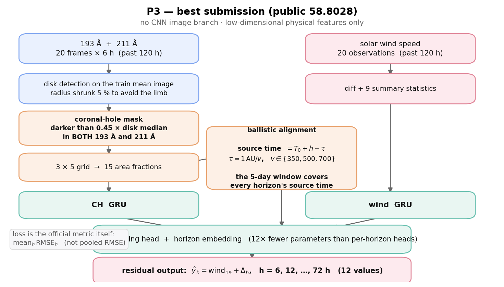
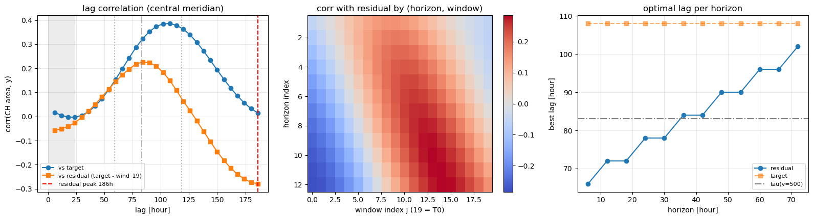
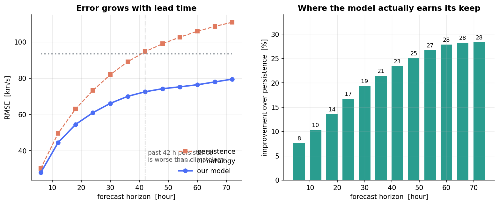
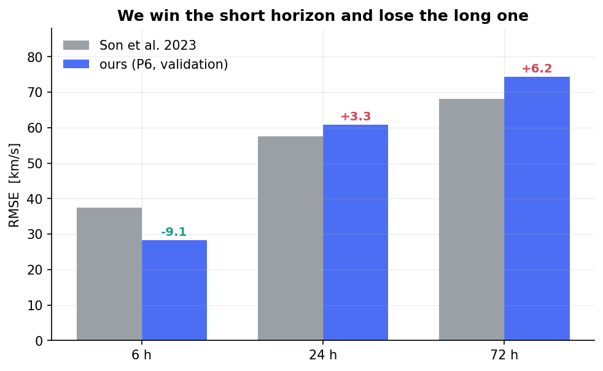
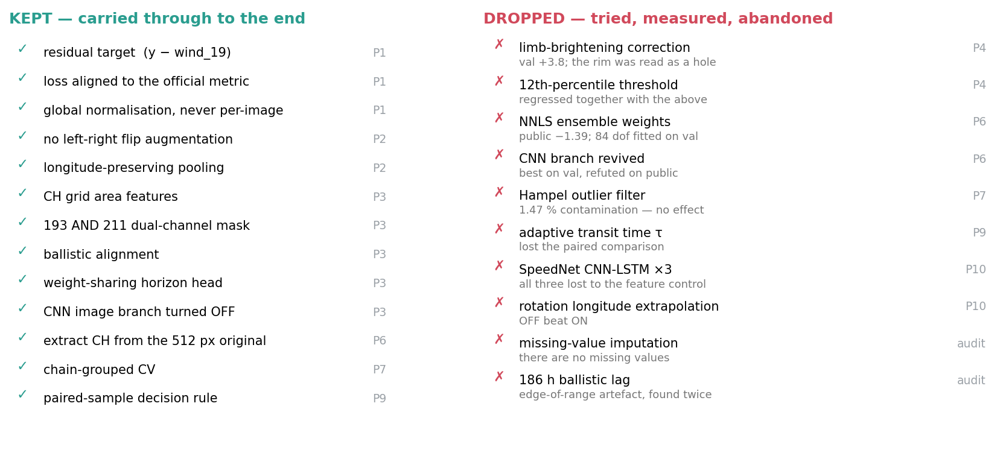
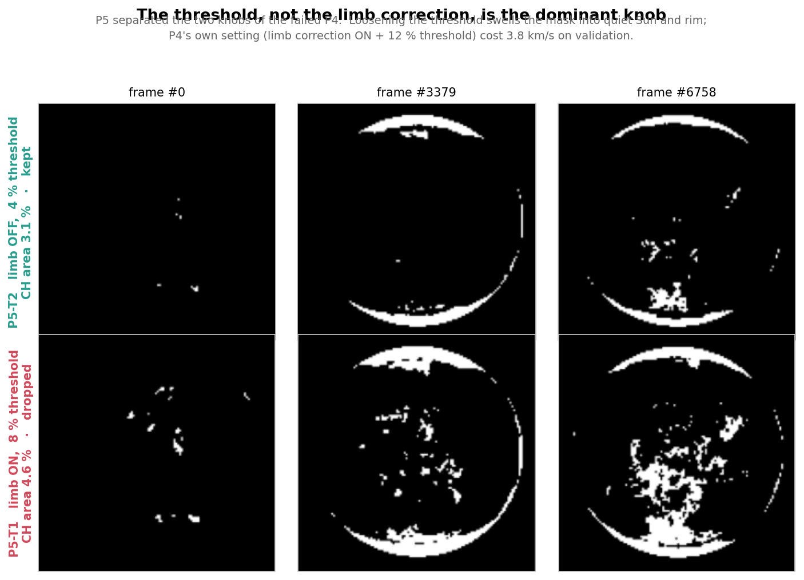
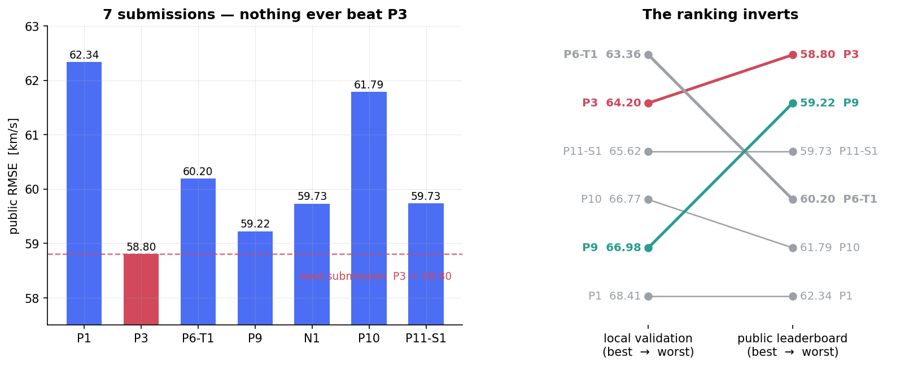
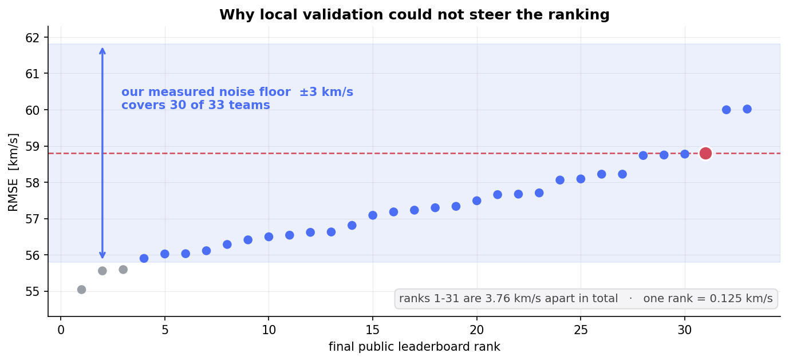
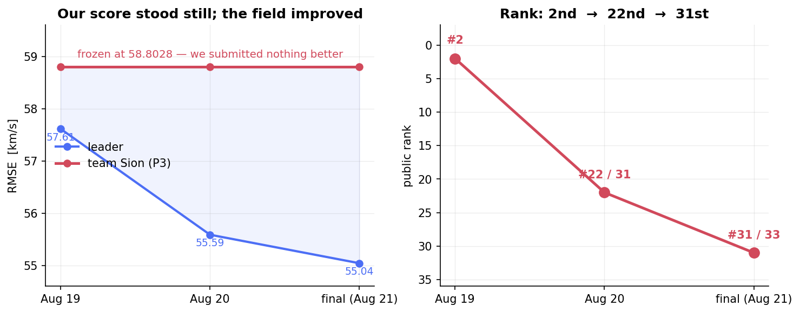

# 태양 관측 영상으로 지구 도달 태양풍 속도 예측하기

**제3회 한국천문연구원(KASI) × KAIST 천문우주 AI 경진대회 — 팀 시온**

   

과거 5일치 SDO/AIA 193 Å · 211 Å 태양 원반 영상과 태양풍 속도로부터,
**앞으로 6시간 ~ 72시간의 지구 도달 태양풍 속도 12개**를 예측한다.

핵심 아이디어는 하나다 — **오늘 보이는 코로나홀이 지구에 닿는 데 걸리는 시간을 계산해서,
horizon 마다 "봐야 할 시점"을 다르게 잡는 것**(탄도 정렬). 최고 제출은 CNN 을 끈
저차원 물리 피처 모델이었다.

전체 엔지니어링 로그는 [`docs/code-report.md`](docs/code-report.md) (877줄) 에 있다.

<details>
<summary><b>English summary</b></summary>

<br>

Predicting Earth-arriving solar wind speed (6 h – 72 h ahead, 12 horizons) from
5 days of SDO/AIA 193 Å / 211 Å full-disk images plus 20 past wind observations.
National competition hosted by KASI and KAIST; **5th overall in the qualifying round**,
then 33 teams in the final.

Our best submission (`P3`, public RMSE **58.8028**) is a deliberately small model:
coronal-hole area on a 3×5 disk grid, **ballistically aligned** to each forecast horizon
(source time = `T0 + h − 1AU/v`), fed to a GRU with a weight-sharing head. **No CNN image
branch** — the image branch was refuted four independent times on this dataset.

The most expensive lesson was about measurement, not modelling. Validation ranked `P6`
first (it came 4th on the leaderboard) and `P9` next-to-last (it came 2nd). A paired,
seed-averaged, chain-grouped CV read a **2.56 km/s** public gap as **0.013 km/s, with the
sign reversed.** Measured noise floor ±3 km/s; leaderboard spacing 0.125 km/s per rank.

</details>

---

## 결과

| | |
|---|---|
| **예선** | AI 퀴즈 40/40 (**1위**) · 우주 퀴즈 58/60 (6위) → **총점 98점, 종합 5위** (점수가 기록된 67팀 기준) |
| **본선** | public RMSE **58.8028** — 33팀 중 31위. 08-19 시점에는 2위였다 |



7번 제출했고, **두 번째 제출인 `P3` 를 끝내 아무것도 넘지 못했다.**

| 제출 | 내용 | val | **Public** | P3 대비 |
|---|---|---:|---:|---:|
| P1 | 잔차 예측 + wind GRU + 지표 정렬 + 128 px | 68.408 | 62.3393 | +3.54 |
| **P3** | **CH 격자 + 탄도 정렬, CNN 끔** | 64.203 | **58.8028** ★ | — |
| P6-T1 | 512 px 추출 + 다중 임계 + 7모델 NNLS 앙상블 + EMA | **63.357** | 60.1955 | +1.39 |
| P9 | 대응 표본 CV 계측기 + 적응형 τ | 66.978 | 59.2246 | +0.42 |
| N1 | baseline 에 SpeedNet 만 최소 이식 | — | 59.7313 | +0.93 |
| P10 | SpeedNet + Stonyhurst 투영 | 66.772 | 61.7853 | +2.98 |
| P11-S1 | 무적합 균등가중 앙상블 6멤버 | 65.622 | 59.7332 | +0.93 |

★ 최고 제출. **val 이 최저인 모델(P6)과 Public 이 최저인 모델(P3)이 서로 다르다** —
이 프로젝트에서 가장 비싸게 배운 것이 여기 있다 ([아래](#가장-비싼-교훈--로컬-지표가-순위를-못-맞혔다)).

---

## 문제

코로나홀(coronal hole)은 태양 대기에서 자기력선이 열려 있는 영역이고, EUV 영상에서
어둡게 보인다. 여기서 빠져나온 고속 태양풍이 며칠 뒤 지구에 도달한다.
**"오늘 태양 원반의 어디가 어둡게 보이는가"에서 "3일 뒤 지구의 태양풍이 얼마나 빠른가"를
읽어내는 것**이 이 과제다.

| 항목 | 내용 |
|---|---|
| 입력 | 과거 120 h (20시점 × 6 h) 의 193 Å · 211 Å 영상 20쌍 + 태양풍 속도 20개 |
| 출력 | 이후 6 h ~ 72 h 를 6시간 간격으로 **12개** |
| 지표 | horizon 별 RMSE 를 먼저 낸 뒤 **평균** (pooled RMSE 와 1.5~2.0 km/s 다르다) |
| 데이터 | train 9,607 / validation 1,199 / test 3,868 샘플, 512×512 8bit PNG |
| 제약 | 외부 데이터 · pretrained weight · validation 학습 사용 · test target 역산 **전부 금지** |

### 데이터에 숨어 있던 구조 — 설계를 지배한 한 문단

**샘플은 6시간 stride 슬라이딩 윈도우다.** 연속한 두 샘플이 입력 영상의 19/20 을 공유한다.

| | 값 |
|---|---|
| 명목 train 샘플 / 고유 이미지 | 9,607 / 10,139 |
| **실질 독립 표본** | 태양 자전 약 **135회전분** |
| **1 epoch 의 실제 의미** | 독립 데이터를 **20회 통과** |
| 무작위 행 분할 시 eval 프레임이 train 에도 등장하는 비율 | **99.8 %** (사슬 통째 배정 시 0 %) |
| validation 1,199 샘플의 실질 크기 | 태양 자전 **11회전** |

CNN 이 반복해서 과적합한 것도, validation 을 믿을 수 없었던 것도 전부 여기서 나온다.

---

## 접근 — 최고 제출 P3



**설계 원칙은 하나다 — 이 데이터로 CNN 을 학습시킬 만큼의 독립 표본이 없다.**
그래서 영상 브랜치를 끄고, 물리적으로 의미가 확실한 저차원 피처만 남겼다.

**① 코로나홀 마스크** — 원반 내부 중앙값 대비 0.45 배보다 어두우면서 **193 Å 과 211 Å 두
채널 모두에서** 어두운 픽셀. 두 채널 AND 조건이 필라멘트 오검출을 막는다(필라멘트는 한쪽
파장에서만 어둡다). 원반은 반지름을 5 % 줄여 림 밝아짐 구간을 후보에서 뺀다.
**per-image 정규화는 금지** — 코로나홀은 "절대적으로 어두운" 영역이라 이미지마다 밝기를
맞추면 신호 자체가 사라진다.

**② 격자 binning** — 마스크를 원반 위 `3 × 5` 격자로 나눠 셀별 면적 비율 15개.
근거는 Collin et al. 2025 — 코로나홀 면적을 격자 binning 한 소수의 물리 피처 + 단순 회귀가
최신 DNN 과 MHD 시뮬레이션을 모두 이겼다.

**③ ★ 탄도 정렬 (ballistic alignment)** — 논문에 없는, 이 대회 고유 설계다.
전달 시간이 `τ = 1 AU / v` 이므로 horizon `h` 타깃을 만든 사건은 `T0 + h − τ` 에 일어났다.

| horizon | v = 500 km/s 기준 근원 시각 | 20프레임 윈도우 내 위치 |
|---:|---|---:|
| 6 h | T0 − 77 h | 인덱스 6.15 |
| 72 h | T0 − 11 h | 인덱스 17.15 |

**5일 윈도우가 모든 horizon 의 근원 시각을 정확히 덮는다** — 문제 설계가 그렇게 되어 있다.
속도 3개(350 / 500 / 700)로 근원 시각을 역산해 그 시점의 중앙자오선 셀 면적을 선형보간한다.
**horizon 마다 봐야 할 시점이 다르다**는 물리를 모델에 직접 넣은 것이다.

EDA 로 전제를 검증했다 — 지연 상관 봉우리가 **+96 ~ 108 h** 에 서고, 이론 전달시간
(평균 379.5 km/s 기준 110 h)과 정합한다.



<sub>왼쪽: 중앙자오선 CH 면적과 타깃의 지연 상관. 가운데: (horizon, 윈도우 인덱스) 별 잔차 상관 — 대각선 구조가 탄도 정렬의 근거다. 오른쪽: horizon 별 최적 지연.</sub>

**④ 출력단** — `target − wind_19` 잔차를 학습해 persistence 에서 출발하고,
**12개 horizon 이 head 를 공유**한다(horizon embedding + 해당 horizon 의 탄도 피처로만 구분).
horizon 별 별도 head 대비 파라미터가 12배 적어 정규화 효과가 크다.
손실은 공식 지표 `mean_h(RMSE_h)` 를 직접 최소화한다.

### 성능





**단기(6 h)는 이 과제의 원본 논문(Son et al. 2023)을 9.1 km/s 앞서고, 장기(72 h)는
6.2 km/s 뒤진다.** 지표가 12개 horizon 평균이므로 승부처는 장기다 — 36 h 이상 7개를 각
4 km/s 줄이면 전체가 2.33 내려가고, 6 h 를 1 km/s 깎아 봐야 전체 기여는 0.08 이다.
이 계산이 이후 모든 표적 설정의 근거였다.

---

## 쓴 것과 버린 것

20개가 넘는 버전을 만들었다. 각 버전의 상세는
[`experiments/README.md`](experiments/README.md) 와 [`docs/code-report.md`](docs/code-report.md) 에 있다.



### 살아남은 것

| 아이디어 | 도입 | 근거 |
|---|:--:|---|
| 손실을 공식 지표 `mean_h(RMSE_h)` 에 정렬 | P1 | baseline 은 pooled RMSE 를 쓰고 있었다. 두 값이 1.5~2.0 km/s 다르다 |
| 잔차 예측 (`target − wind_19`) | P1 | persistence + 평균 드리프트에서 출발 → 수렴 가속 |
| 전역 정규화 (per-image 금지) | P1 | 코로나홀은 절대적으로 어두운 영역. 이미지별 정규화하면 신호가 사라진다 |
| 좌우 반전 증강 금지 | P2 | 태양 자전 방향(동→서)이 뒤집혀 물리가 깨진다 |
| 경도 보존 풀링 | P2 | 경도가 도달 시간을 결정한다 |
| **CNN 영상 브랜치 끄기** | P3 | 고유 이미지 10,139장 = 실질 자전 135회전. **네 번 독립적으로 반증됐다** |
| 193 AND 211 이중 채널 마스크 | P3 | 한쪽 파장에서만 어두운 필라멘트를 배제 |
| CH 격자 면적 피처 | P3 | Collin 2025 — 소수의 물리 피처가 DNN·MHD 를 능가 |
| **탄도 정렬** | P3 | 지연 상관 봉우리 +96~108 h 가 이론 전달시간 110 h 와 정합 |
| horizon 가중치 공유 head | P3 | 파라미터 12배 감소 |
| 512 px 원본에서 CH 추출 | P6 | 128 px 축소본보다 면적 추정이 안정적 |
| 사슬 통째 배정 CV | P7·P18 | 무작위 행 분할이면 eval 프레임의 **99.8 %** 가 train 에도 등장 |
| 대응 표본(paired) 판정 | P9 | `paired_se` 가 `unpaired_se` 보다 3~5배 작다 → 실행 횟수를 그만큼 아낀다 |

### 버린 것

| 시도 | 어디서 | 측정 결과 |
|---|:--:|---|
| 림 밝아짐 보정 + 12 % 백분위 임계 | P4 | **val 67.988 (+3.8).** 임계만 8 % 로 조이면 64.996 으로 회복 → 범인은 느슨한 임계 |
| NNLS 앙상블 가중치 | P6 | **Public +1.39.** 같은 설정 재실행에 가중치가 뒤집힌다 (0.56 → 0.088). 자유도 84개를 자전 11회전짜리 val 에 적합했다 |
| CNN 브랜치 부활 | P6 | val 로는 최강(63.613)이었으나 Public 에서 반증 |
| Hampel 이상치 필터 | P7 | 윈도우 오염 1.47 % (기준 5 %) — 실효 없음 |
| 적응형 전달시간 τ | P9 | 대응 비교에서 P7 고정 설정을 못 이김. **계측기가 자기 개선안을 기각했다** |
| SpeedNet CNN-LSTM 3종 | P10 | BM / EUV / hybrid 전부 맵 없는 격자 피처 대조군에 패 |
| 중앙자오선 ±10° 밴드 + ±60° crop | P10 | **Public +2.98.** 전 경도를 쓴 P9 가 2.56 앞섰다. 논문의 attribution 결론을 피처 설계로 옮긴 것이 역효과 |
| 자전 경도 외삽 | P10 | OFF 가 ON 을 이김 |
| 결측 보간 · `valid` 플래그 채널 | 무결성 감사 | **결측이 0개다.** `valid` 는 전 split 평균 1.000000 = GRU 의 죽은 입력 |
| 186 h 탄도 지연 | 무결성 감사 | 테스트 lag 범위 끝단의 저주파 아티팩트. **두 번 다 걸려들 뻔했다** (물리 봉우리는 +96 h) |
| pretrained Swin 영상 브랜치 | F1 | 대회 규정상 pretrained weight 사용 금지 — 제출 없이 중단, 저장소에서 제외 |

> **규정상 처음부터 배제:** 흑점수 · 천체력(B0 · 헬리오위도) · ICME 목록 · 27일 전 태양풍
> (전부 외부 데이터). **Box-Cox 변환**은 Collin 논문이 명시한다 — HSS peak 향상은
> timeline RMSE 저하의 대가(68.1 → 75.1)이고, 우리 지표가 timeline RMSE 이므로 **쓰면 손해**다.

### 실패를 두 조각으로 잘라 원인을 특정하기 — P4 → P5

P4 가 3.8 km/s 를 잃었을 때 문제는 "림 보정과 임계값 중 무엇이 범인인가"였다.
P5 는 **학습 없이 신호 품질(타깃과의 상관)만 재는 셀**을 넣어 두 노브를 분리했다.



sweep 전체에서 **임계값이 지배 변수**임이 드러났다(타깃 상관 0.107 ~ 0.339, 3배 차이).
격자 구조나 모델보다 임계가 중요하다. 이후 림 보정은 영구 폐기하고, 임계는 노브 목록의
맨 앞에 두었다.

---

## 가장 비싼 교훈 — 로컬 지표가 순위를 못 맞혔다

이 프로젝트에서 실제로 시간을 가장 많이 쓴 축은 모델이 아니라 **"무엇을 믿고 다음 버전을
고를 것인가"** 였다. validation → 사슬 CV → 시드×폴드 대응 비교로 계측기를 세 번 갈아엎었다.

그리고 **그 계측기가 실측으로 반증됐다.**



- val 이 **1위로 뽑은 P6** 은 Public 4위
- val 이 **꼴찌 직전으로 둔 P9** 는 Public 2위
- **P9 vs P10** — 조건이 가장 가까운 두 모델인데, 정밀 CV 가 **Public 2.56 km/s 차이를
  0.013 으로, 그것도 부호까지 반대로** 읽었다



| | 값 |
|---|---|
| 우리 계측 노이즈 바닥 (시드 편차 + val 표본 오차) | **약 3 km/s** |
| 최종 리더보드 계단 하나 | **0.125 km/s** |
| **±3 km/s 안에 들어 있는 팀** | **33팀 중 30팀** |

**계측기가 "차이 없음"이라 판정하는 구간 안에 리더보드 거의 전체가 들어 있다.**
로컬에서 유의하게 측정되는 개선만 채택하는 전략으로는 이 밀도의 리더보드에서 순위를 못 올린다.
점수가 고정된 채 순위만 2위 → 31위로 내려앉은 것이 그 전략의 직접적 결과다.



**다음에 같은 문제를 만나면** — 계측기를 더 정교하게 만드는 대신, P3 급 단일 모델 + 시드
앙상블로 바닥을 먼저 깔고(적합 파라미터 0개라 나빠질 구조적 이유가 없다), 남은 제출 횟수를
전부 탐색에 쓰겠다. 실제로 기존 제출본들의 오차 상관에서 역산한 `P3 + P9 + N1` 균등 평균의
기대값은 **56.72** (P3 대비 −2.08) 였는데, 마지막 날에야 시도해서 놓쳤다.

---

## 저장소 구조

```
solar-wind-project-2026/
├── figures/          그림 15장 — 위에 실린 10장 + EDA 5장 (인덱스는 폴더 안 README)
├── docs/
│   ├── code-report.md    ★ 버전별 계보 보고서 877줄 — 이 프로젝트의 1차 사료
│   ├── plan-p11.md       잔여 1일 시점의 전략 문서
│   ├── references.md     참고 문헌과 "무엇을 어디에 썼는가" 매핑
│   ├── runbooks/         버전별 실행 안내 9편
│   └── competition/      대회 규정 · 주최측 자료
├── src/
│   ├── extract/          물리 피처 오프라인 추출
│   ├── analysis/         무결성 감사 · 타임라인 복원 · 사슬 CV · 그림 생성
│   └── builders/         노트북 생성기 14종
└── experiments/      ★ 20개 버전의 노트북 · 가중치 · 제출 CSV
```

**의도적으로 포함하지 않은 것** — 대회 데이터셋과 그 파생 캐시(반출 금지),
참고 문헌 PDF 원문(유료 저널 저작물, [`docs/references.md`](docs/references.md) 의 인용
매핑으로 대체), pretrained Swin 실험(대회 규정상 금지 항목).

---

## 재현 방법

대회 데이터가 필요하다. 노트북은 `SW_DATA_ROOT` 또는
`public_dataset/competition_dataset_6h` 에서 데이터를 찾는다.

```bash
export SW_DATA_ROOT=/path/to/competition_dataset_6h
jupyter nbconvert --to notebook --execute --inplace \
  experiments/p03-coronal-hole-grid/code_p3.ipynb
```

첫 실행에서 이미지·코로나홀 캐시를 만들고(수 분), 이후 버전들이 그대로 재사용한다.
물리 피처가 필요한 버전(P11·P14~P16)은 [`src/README.md`](src/README.md) 참고.

이 README 의 그림은 **대회 데이터 없이** 다시 만들 수 있다.

```bash
python src/analysis/make_portfolio_figures.py
python src/analysis/make_portfolio_figures_2.py
```

---

## 참고 문헌

| 논문 | 어디에 썼나 |
|---|---|
| **Son et al. 2023** — *Three-day Forecasting of Solar Wind Speed Using SDO/AIA EUV Images* | **이 대회의 원본 과제.** 동일 입력·출력. 표적 설정의 기준선 |
| **Collin et al. 2025** — *Forecasting High-Speed Solar Wind Streams From Solar Images* | P3~P7 의 뼈대. CH 면적 격자 binning |
| **Abraham-Alowonle et al. 2026** — *DL-Based Prediction of High-Speed Solar Wind Streams* | P10 · N1 의 SpeedNet · Stonyhurst 투영 |
| **Upendran et al. 2020** — *Solar Wind Prediction Using Deep Learning* | 채널 선택 근거 (211 Å 우세) |
| **Milošić et al. 2023** | P10 · N1 의 동적 임계 CH 검출 |

각 논문에서 **무엇을 가져오고 무엇을 왜 버렸는지**는
[`docs/references.md`](docs/references.md) 에 정리했다.

---

<sub>
대회 주최: 한국천문연구원(KASI) · KAIST · 2026<br>
<code>docs/competition/</code> 아래 자료는 주최측 저작물이며 대회 기록 보존 목적으로만 포함했다.<br>
코드와 문서는 <a href="LICENSE">MIT License</a>.
</sub>
